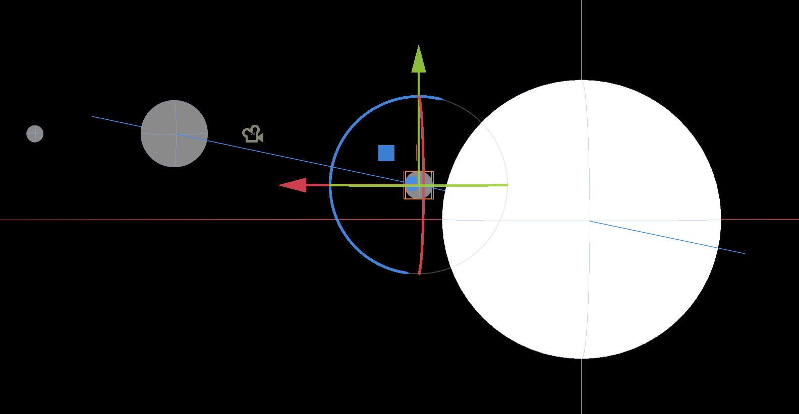

# planet sim!

a (unfinished) planet simulation. currently, only gravity is implemented, but eventually id like to add an atmosphere as well. based on sebastian lague's projects.

to run: clone the repo and open it in godot! then you can copy and place bodies around and watch them collide. you can also change the universal gravitational constant. have fun!
